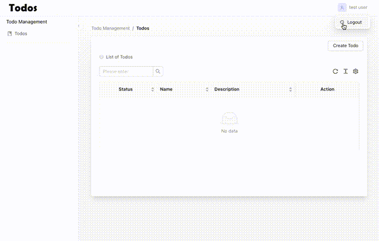

# Todo Web

Todo Web is a full-stack web application built with ReactJS for the frontend and AdonisJS for the backend. This project showcases a modern web application architecture, utilizing ReactJS with Ant Design for a responsive and user-friendly interface, and AdonisJS with MySQL for a robust backend.

<!-- display recording gif here on folder ./recording/todo.gif -->


## Table of Contents
-   [Installation](doc:linking-to-pages#installation)
-   [Client Setup](doc:linking-to-pages#client-setup)
-   [Api Setup](doc:linking-to-pages#Api-setup)
-   [Running the Application](doc:linking-to-pages#running-the-application)

## Installation

### Client Setup

The client-side of Todo Web is built with ReactJS and Ant Design. To set up the client, follow these steps:

1.  Navigate to the  `Client`  directory:

```
cd client
```

2.  Install the project dependencies:

```
npm install
```

3.  Create a  `.env`  file in the root of the  `Client`  directory and add the following environment variable, only for development not include this in production:

```
VITE_DEMO_MODE=true
```

This variable enables demo mode in the application.

### Api Setup

The `api` folder contains the backend of the application, developed using AdonisJS framework with MySQL as the database.

To set up the backend, follow these steps:

1.  Navigate to the  `api`  directory:

```
cd api
```

2.  Install the project dependencies:

```
npm  install -g @adonisjs/cli
```

3.  Install the project dependencies:

```
npm install
```

4.  Or if npm Install didn't go very well, you can use yarn to install packages:

```
yarn install
```

5.  Create a  `.env`  file in the root of the  `api`  directory. You can copy the  `.env.example`  file as a starting point:

```
cp .env.example .env
```

6.  Run the database migrations:

```
adonis migration:run
```


7.  Run the database seeders:

```
adonis seed
```

8.  Generate the application key:

```
adonis key:generate
```

Ensure that the `.env` file exists before running this command.

## Running Locally

Create a Database for Todo

1. Open Terminal and log in to MySQL as root:

```
mysql -u root -p
```

2. Create a new database:

```
CREATE DATABASE todo;
```

3. Exit MySQL:

```
exit
```

## Running the Application

To run both the client and the backend, follow these instructions:

### Running the Client

1.  Navigate to the  `Client`  directory:

```
cd Client
```

2.  Start the development server:

```
npm run dev
```

Alternatively, you can use Yarn if you prefer:

```
yarn run dev
```

### Running the API Backend

1.  Navigate to the  `Client`  directory:

```
cd api
```

2.  Start the development server:

```
npm run start
```

Alternatively, you can use Yarn if you prefer:

```
yarn run start
```

That's it! You're now ready to use Todo. If you encounter any issues during setup or have any questions, feel free to reach out to us. Enjoy using Todo Web!